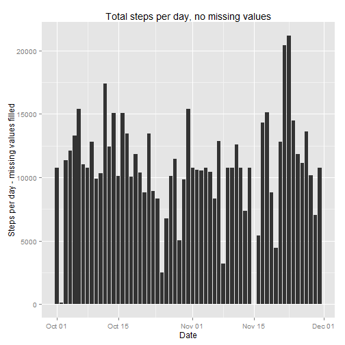
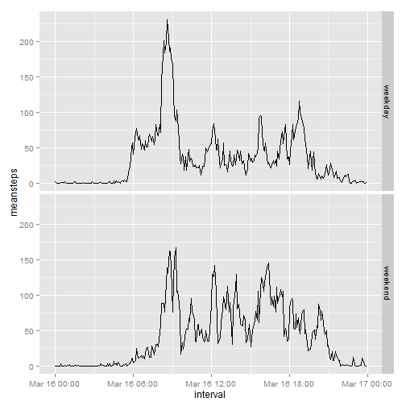

## Loading and preprocessing the data

```r
options(scipen = 1, digits = 2)                                          # numbers > 10^5 are denoted in scientific notation, 2 sig figs
library(dplyr,     warn.conflicts = FALSE)
library(stringr,   warn.conflicts = FALSE)
library(ggplot2,   warn.conflicts = FALSE)
library(lubridate, warn.conflicts = FALSE)
library(knitr,     warn.conflicts = FALSE)


# Download data if necessary
fnActivity <- "activity.csv"

if ( !file.exists(fnActivity )) {
    message("Data file(s) missing, downloading....")
    download.file("https://d396qusza40orc.cloudfront.net/repdata%2Fdata%2Factivity.zip", fnActivity)
    message("Unzipping data files...")
    unzip(fnActivity)
}
# Read data
activity <- read.csv(file = "activity.csv",header = TRUE, sep = ",",stringsAsFactors = FALSE)

# mean total no. steps per day
activity.by.day     <- group_by(activity, as.factor(activity$date))
activity.by.day.sum <- summarize(activity.by.day, sum(steps))

# add names to allow further calculations
names(activity.by.day.sum) <- c("Date", "TotalSteps")

# calculate measures of centre
stepsmean   <- mean(  activity.by.day.sum$TotalSteps, na.rm = TRUE)
stepsmedian <- median(activity.by.day.sum$TotalSteps, na.rm = TRUE)

# Prepare data for plotting
activity.by.day.sum$Date <- as.POSIXlt(strptime(activity.by.day.sum$Date, "%Y-%m-%d"))
qplot(x=activity.by.day.sum$Date,y=activity.by.day.sum$TotalSteps,
      geom="histogram",stat="identity", 
      xlab="Date", ylab="Steps per day")
```

```
## Warning: Removed 8 rows containing missing values (position_stack).
```

 

## What is mean total number of steps taken per day?
The mean number of steps taken per day is 10766.19.  
The median number of steps taken per day is 10765.

## What is the average daily activity pattern?
The following code plots the mean number of steps per 5-minute interval across the observation period.  

```r
activity.by.interval <- group_by(activity,as.factor(activity$interval))

activity.by.interval.mean <- summarize(activity.by.interval, mean(steps,na.rm = TRUE))
names(activity.by.interval.mean) <- c("interval", "stepsperinterval")

# Transform interval
activity.by.interval.mean$interval <- str_pad(as.character(activity.by.interval.mean$interval),4,side="left",pad="0")  #convert & left pad with zeroes
activity.by.interval.mean$interval <- as.POSIXct(strptime(activity.by.interval.mean$interval, "%H%M"))   # TODO: contains day of year as well, remove

qplot(x=activity.by.interval.mean$interval, y=activity.by.interval.mean$stepsperinterval, geom="line") + 
    scale_x_datetime(minor_breaks = "1 hour") +
    xlab("Interval") +
    ylab("Mean steps per interval")
```

 

This code determines the maximum number of steps and the interval in which this maximum occurs.

```r
maxsteps <- max(activity.by.interval.mean$stepsperinterval)
maxint   <- filter(activity.by.interval.mean, stepsperinterval== maxsteps)
```

The maximum number of steps in a 5-minute interval is 206.17. This occurs between 8:30 and 8:35. 

## Inputting missing values
There are 2304 missing values in the Activity dataset, calculated from:  

```r
countNA <- nrow(activity) - sum(complete.cases(activity))
```
To fill a missing interval value, the strategy is to replace the missing value by the mean value for the same period over the observation period (61 days). For example, if 00:40 to 00:45 is NA on 1 October, replace it with the mean calculated from all days where there is a value; in this case the mean is 1.47.


```r
# Create a new dataset
activitycomplete <- activity

# if an interval is NA, fill it in with the mean value, otherwise copy the existing value
activitycomplete$steps <- ifelse(is.na(activity$steps), activity.by.interval.mean$stepsperinterval, activity$steps)
```

The total steps per day, mean and median can now be recalculated as follows:

```r
# mean total no. steps per day
activitycomplete.by.day     <- group_by(activitycomplete, as.factor(activitycomplete$date))
activitycomplete.by.day.sum <- summarize(activitycomplete.by.day, sum(steps))

# add names to allow further calculations
names(activitycomplete.by.day.sum) <- c("Date", "TotalSteps")

# calculate measures of centre
stepsmeancomplete   <- mean(  activitycomplete.by.day.sum$TotalSteps)  #don't need na.rm here
stepsmediancomplete <- median(activitycomplete.by.day.sum$TotalSteps)

# Prepare data for plotting
activitycomplete.by.day.sum$Date <- as.POSIXlt(strptime(activitycomplete.by.day.sum$Date, "%Y-%m-%d"))
qplot(x=activitycomplete.by.day.sum$Date,y=activitycomplete.by.day.sum$TotalSteps,
      geom="histogram",stat="identity", 
      xlab="Date", ylab="Steps per day - missing values filled")
```

 

The mean number of steps taken per day calculated using the filled-in data is 10766.19, compared with 10766.19 using the original data.  
The median number of steps taken per day calculated using the filled-in data is 10766.19, compared with 10765 using the original data.
The values calculated from the filled-in data are almost identical to those calculated from the original, "gappy" data, indicating that the measures of centre (mean/median) are not greatly changed by filling in missing data. 

## Are there differences in activity patterns between weekdays and weekends?

To examine activity patterns on weekends vs weekdays, we first add a factor indicating "weekday" or "weekend".

```r
activitycomplete$day <- as.factor(ifelse((wday(activitycomplete$date)==1)|(wday(activitycomplete$date)==7),"weekend","weekday"))  
# Now determine the means across two separate observation periods: 2 days for weekend, 5 days for weekday

a <- activitycomplete  #dup
a$date <- as.character(a$date)   #group by, avoid POSIX error

a$interval <- as.factor(a$interval)  #so we can take the mean
names(a) <- c("steps","date","intervalf","dayf")  #indicate the latter two variables are factors

a.int <- group_by(a,intervalf)  #ok so far
#a.int.mean <- summarize(a.int,mean(steps))
a.int$intervalf <- str_pad(as.character(a.int$intervalf),4,side="left",pad="0")
a.int$intervalf <- as.POSIXct(strptime(a.int$intervalf, "%H%M"))

print(qplot(x = a.int$intervalf, y = a.int$steps, data=a.int,  
            facets= dayf ~ . , geom="line",stat="identity",       
            main="Activity patterns on weekday and weekend", xlab="Interval", ylab="Mean steps per 5 min interval" ) )
```

 

